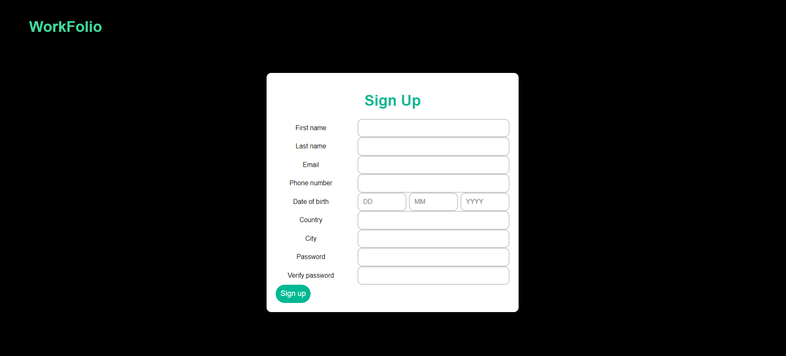
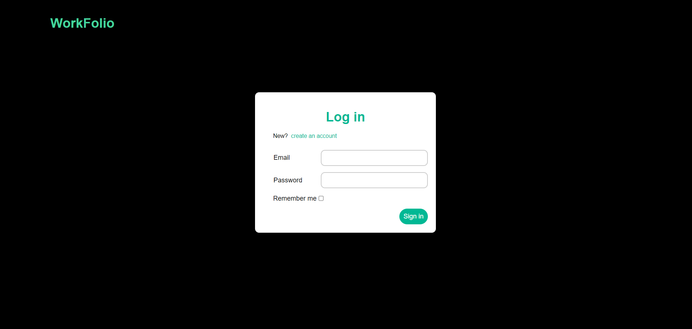
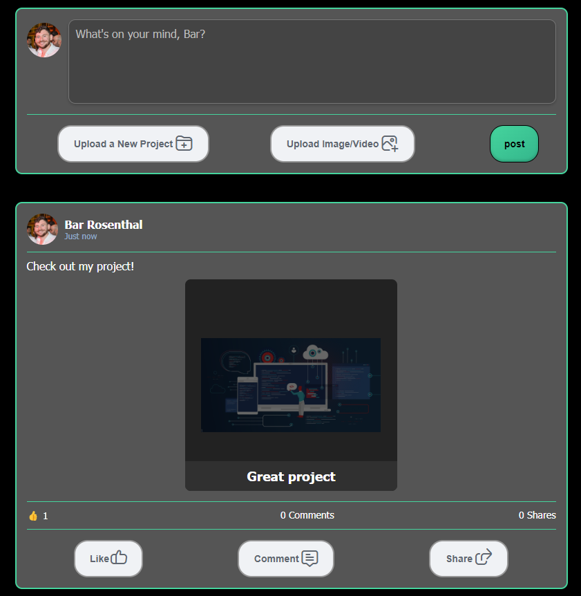
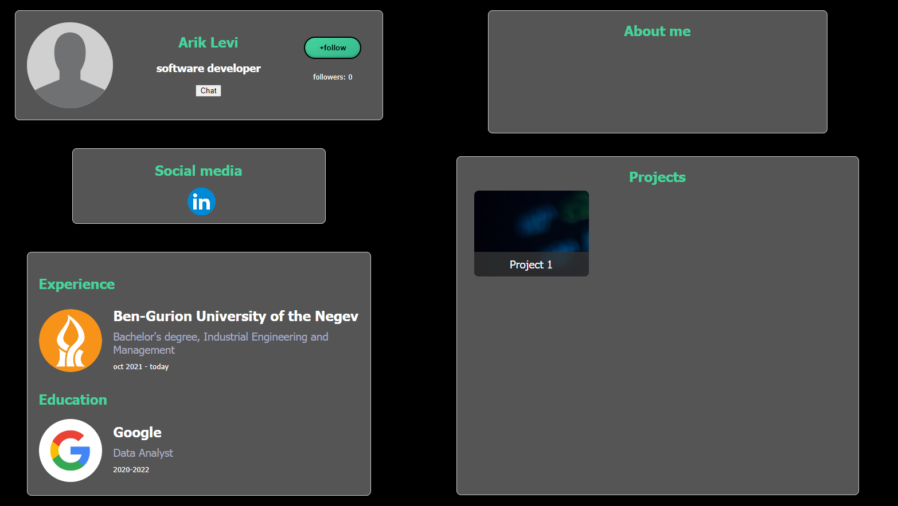
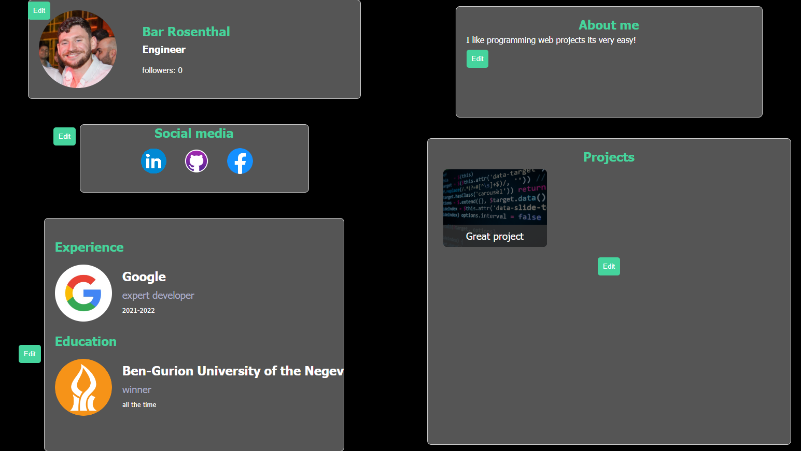
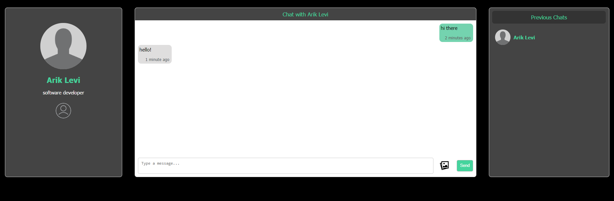
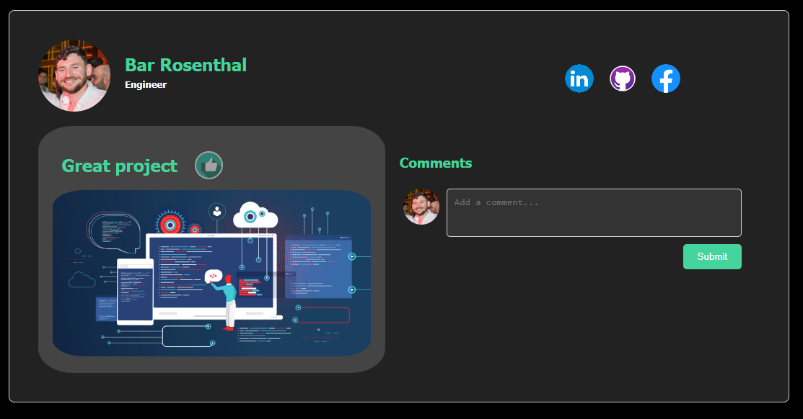
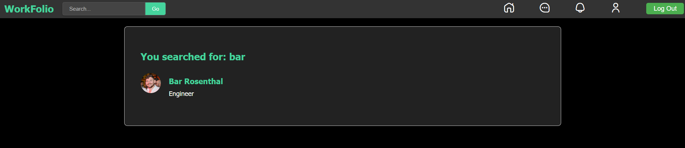
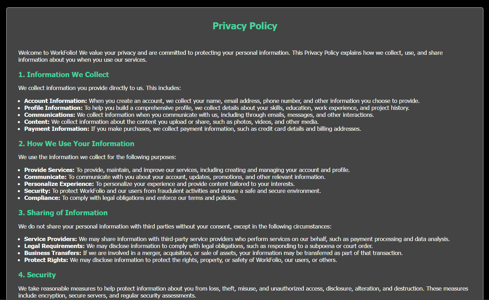
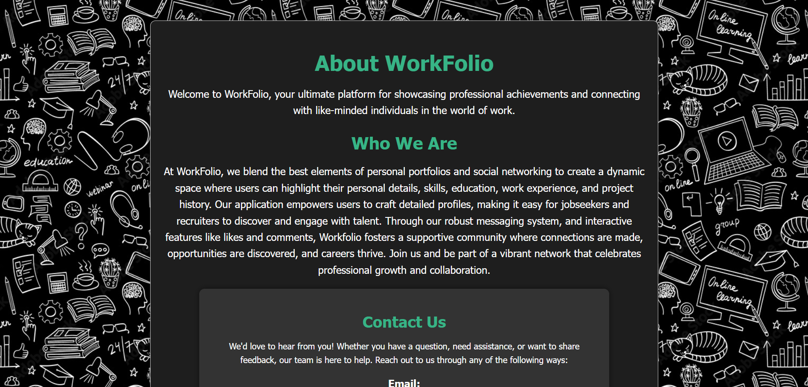

# WorkFolio WEB Project

This is a web application with various pages designed to provide different functionalities. Below is a brief description of each page and its purpose.

## 1. Brief Description

The Workfolio application combines personal work portfolios of registered users with features of social networks. Users can create personal profiles where they showcase their personal details, skills, education, work experience, and project histories. Users can connect with other users with similar interests, search for and follow other users and organizations, and communicate through the chat feature. The application also allows users to create posts, upload projects, share images, and engage with others through likes and comments.
## 2. Sequence of Operations

### 2.1 Sign Up
- **Description**: Allows for the creation of a new user.
- **Operations**: Users can enter their details to register for the site.

### 2.2 Login
- **Description**: The first page any user will run into.
- **Operations**: Requires the user to sign in with their registered account.

### 2.3 Home
- **Description**: The main page of the website.
- **Operations**: Allows for creating posts, project uploads, image sharing, post sharing, and viewing other users' posts in the feed.

### 2.4 Profile
- **Description**: Displays the profile pages of users who are not the current user.
- **Operations**: Allows following other users and viewing their information (name, role, organization, about, and projects).

### 2.5 My Profile
- **Description**: The page of the user that is currently logged in.
- **Operations**: Allows editing user information including profile picture, social media links, experiences, education, and about me section.

### 2.6 Chat
- **Description**: A page where all users can communicate on a personal level and share their ideas.
- **Operations**: Users can send and receive messages.

### 2.7 Project
- **Description**: A project's page.
- **Operations**: Allows users to view individual projects and download them for further inspection.

### 2.8 Search Results
- **Description**: Allows to look up other users.
- **Operations**: Users can search for content and view the results.

### 2.9 Organization
- **Description**: The page for viewing an organization's information.
- **Operations**: Displays social media links and allows users to follow their favorite organization.

### 2.10 Privacy Policy
- **Description**: The website's privacy policy.
- **Operations**: Displays static content regarding privacy policies.

### 2.11 About Us
- **Description**: A description of who we are for users who are interested to know who built the website.
- **Operations**: Displays static content about the organization.

## 3. Appendices

### 3.1 Sequence of Operations for Simulating Activity

1. **Login**:
    - Navigate to the login page and enter your credentials to log in.

2. **Navigate to Home**:
    - Once logged in, you will be redirected to the home page where you can create posts, upload projects, share images, and view the feed.

3. **View and Edit Profile**:
    - Navigate to your profile page from the home page to view and edit your profile information.

4. **Chat with Users**:
    - Access the chat page to communicate with other users.

5. **Explore Organizations**:
    - Visit the organization page to view details about various organizations and follow them.

6. **Search for Users**:
    - Use the search functionality to look up other users on the platform.

